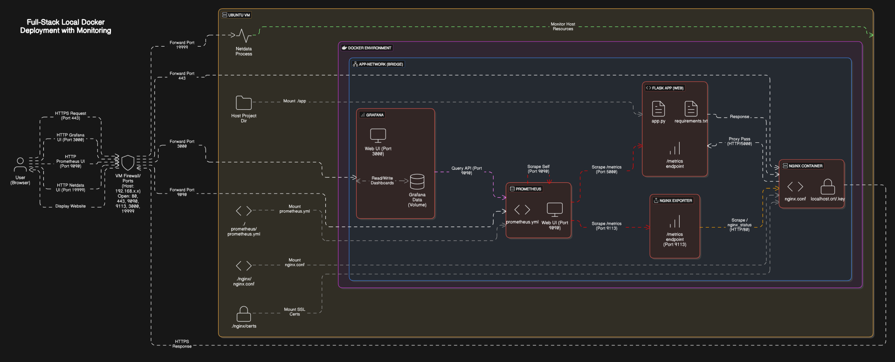

# Local Dockerized Web Application with Nginx, SSL & Monitoring

This project demonstrates a containerized web application deployment using Docker Compose. It includes a Python Flask application, an Nginx reverse proxy with self-signed SSL for local development, and a monitoring stack comprising Prometheus, Grafana, and Netdata.

## Project Overview

This setup simulates a typical modern web deployment locally:

1.  A user's browser makes an HTTPS request.
2.  The request hits the Nginx container, which acts as a reverse proxy. Nginx handles the SSL encryption/decryption using a self-signed certificate.
3.  Nginx forwards the request (now plain HTTP) to the appropriate backend service, in this case, the Flask application container, based on the configuration.
4.  The Flask application processes the request and sends a response back to Nginx.
5.  Nginx sends the HTTPS response back to the user's browser.
6.  Meanwhile, Prometheus periodically scrapes metrics endpoints exposed by the Flask application (`/metrics`) and the Nginx Exporter (`/metrics`).
7.  The Nginx Exporter scrapes Nginx's internal status page (`/nginx_status`) to gather connection and request data.
8.  Grafana connects to Prometheus as a data source, allowing users to query and visualize the collected metrics in dashboards.
9.  Netdata runs independently on the host machine, monitoring system-level resources (CPU, RAM, disk, network).

## Features

*   **Containerized Application:** A Python Flask web application running within a Docker container.
*   **Nginx Reverse Proxy:** Handles incoming HTTPS traffic, terminates SSL, and forwards requests.
*   **Self-Signed SSL:** Enables HTTPS for local development (browser warnings expected).
*   **Monitoring Suite:** Prometheus (collection), Grafana (visualization), Nginx Exporter (Nginx metrics).
*   **Host Monitoring:** Netdata provides real-time system resource monitoring on the host.
*   **Volume Mounting:** Enables live code updates for the Flask application.

## Technology Stack

*   Docker & Docker Compose
*   Python (Flask)
*   Nginx
*   OpenSSL
*   Prometheus
*   Grafana
*   Nginx Prometheus Exporter
*   Netdata

## Architecture Diagram



## Directory Structure

```
docker-ssl-monitoring/
├── app.py              # Flask application code
├── docker-compose.yml  # Docker Compose configuration
├── Dockerfile          # Dockerfile for the Flask app
├── nginx/
│   ├── localhost.crt   # Self-signed SSL certificate
│   ├── localhost.key   # Self-signed SSL private key
│   └── nginx.conf      # Nginx configuration file
├── prometheus/
│   └── prometheus.yml  # Prometheus configuration file
└── requirements.txt    # Python dependencies
```

## Prerequisites

Ensure the following software is installed on your Linux host system:

*   Git
*   Docker Engine
*   Docker Compose
*   OpenSSL
*   `wget` and `curl` (for downloading installers)

## Setup Instructions

1.  **Clone Repository:**
    ```bash
    git clone https://github.com/AdityaJareda/devops-practice.git
    cd docker-ssl-monitoring/
    ```

2.  **Generate Self-Signed Certificate:**
    This step creates the necessary certificate and key for local HTTPS.
    ```bash
    cd nginx
    openssl req -x509 -nodes -days 365 -newkey rsa:2048 -keyout localhost.key -out localhost.crt
    cd ..
    ```

3.  **Install Netdata (Host):**
    Install the Netdata agent directly on the host machine for system monitoring.
    ```bash
    wget -O kickstart.sh https://my-netdata.io/kickstart.sh
    bash kickstart.sh --stable-channel
    ```
    *(Follow installation prompts)*

4.  **Build and Start Services:**
    Use Docker Compose to build the application image and start all defined containers in detached mode.
    ```bash
    docker-compose up -d --build
    ```

## Important Note
Ensure the necessary ports are allowed through the host system's firewall.
The primary ports exposed by this setup that require external access are:

*   **`80/tcp`**: For Nginx (Standard HTTP)
*   **`443/tcp`**: For Nginx (Standard HTTPS)
*   **`3000/tcp`**: For Grafana Web UI
*   **`9090/tcp`**: For Prometheus Web UI
*   **`19999/tcp`**: For Netdata Web UI
*   **`9113/tcp`**: For Nginx Exporter metrics

## Accessing Services

After starting the containers (`docker ps` confirms they are running), access the services via the following URLs (replace `<your-vm-ip>` with your host's IP if not using `localhost`):

*   **Web Application:** `https://localhost/` or `https://<your-vm-ip>/`
    *(Accept the browser security warning for the self-signed certificate)*
*   **Grafana:** `http://localhost:3000` or `http://<your-vm-ip>:3000`
    *(Default login: `admin`/`admin`. Configure Prometheus data source at `http://prometheus:9090`)*
*   **Prometheus:** `http://localhost:9090` or `http://<your-vm-ip>:9090`
    *(Explore metrics and target status)*
*   **Nginx Exporter Metrics:** `http://localhost:9113/metrics` or `http://<your-vm-ip>:9113/metrics`
    *(Raw Nginx metrics - check logs if only basic exporter metrics appear)*
*   **Nginx Status Page:** `https://localhost/nginx_status` or `https://<your-vm-ip>/nginx_status`
    *(Basic connection stats - requires accepting SSL warning)*
*   **Netdata:** `http://localhost:19999` or `http://<your-vm-ip>:19999`
    *(Real-time host system metrics)*

## Understanding Nginx Active Connections

When viewing the Nginx status page (`/nginx_status`), the "Active connections" count may appear higher than the number of users actively browsing the site. This is normal behavior due to:

1.  **Browser Parallelism:** Browsers often open multiple connections to download resources.
2.  **Keep-Alive Connections:** Nginx keeps idle connections open briefly (`keepalive_timeout`) for potential reuse.
3.  **Monitoring Connections:** The Nginx Exporter and your own browser viewing the status page establish connections.

Therefore, seeing several active connections is expected, especially when monitoring tools are active.

## Development Workflow

Changes made to the Python application code (e.g., `app.py`) on the host machine will be reflected immediately in the running `web` container due to the configured volume mount. Simply refresh your browser to see the effects.

---
